# Whatsapp-Bot
Simple Whatsapp bot that sends custom messages and attach multiple images and videos to a CSV contact list. User can specify the contacts that will receive the message and customize each message based on the contact's name. Uses selenium and chromedriver to navigate.

## Main features
* Customized messages
* Multiple attachments per contact
* CSV-based contact lookup
* Prints progress on debug console 
* Uses only reliable and well known libraries
* Source code "map" below to help recalibrate the code with eventual HTML tag changes

## PreRequisites and installation
* Python
* Selenium
* Chromedriver
* Pandas
* CSV contact list
* Any IDE

## How to "drive"
* Prepare your CSV contact list using the structure below:

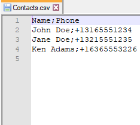

* The CSV contact names must match __exactly__ as they are on the source Phone

* Place the images you want to attach on the images folder (no specific name format is necessary)
  * If you do not wish to attach images, simply leave the images folder empty

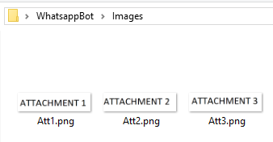

* Create your customizable message in the mainMsg variable
  * To customize the message using the contact's name, use \_NAME\_ between underscores
  * If you won't send any message, uncomment the code that initializes mainMsg as an empty string
  * If your message is in a single line, "cheat" by adding an empty string ("") on the second cell
```Python
  mainMsg = ["Single line message", ""]
```
  * To make your message with more lines, simply add more cells to the mainMsg list
```Python
  mainMsg = ["line 1", "line 2", "line 3", ..., "line n"]
```


* Run the program
  * The code will wait 15 seconds for you to log in to whatsapp web using the QR code
  * After the idle time, it will loop all contacts on the CSV list to send the attachments and messages

## Troubleshooting and common fixes
If the program fails to run correctly, check the following probable causes:
* Python PATH not added to environment variables, which causes Selenium and Pandas to not be detected
* chromedriver.exe version different from your google chrome version
* Slow internet connection. In that case, pages take longer to load. Solution: increase the sleep time variable
```Python
  st = 4
```
* CSV delimiter not specified correctly. Check the correct separator (comma, tab, semicolon etc.)
```Python
  contactsDF = pd.read_csv(csvFileName, error_bad_lines = False, sep = ";")
```
* CSV contacts' names different than your phone contacts list. Name must match completely, character by charater
  * It is recommended to work directly with a copy of your contacts list (downloaded from iCloud or Google) 
* Selenium elements not found. In that case, some strings on web.whatsapp.com source code have changed
  * Manually inspect each element using google chrome and change the identifier strings accordingly
  * This readme has snapshots with approximate locations of each html element (buttons, labels and inputs) used on this bot

## Unfamiliar with Python or Selenium? See the complete setup step by step below
* Install Python from https://www.python.org/
  * When installing, check the box "Add Python to Environment Variables"
* On windows, open cmd.exe and type the following commands
  * "pip install selenium"
  * "pip install pandas"
* Install VS Code from https://code.visualstudio.com/
  * Or any other IDE that you prefer (PyCharm, Spyder etc.)
* Install Chrome's webdriver from http://chromedriver.chromium.org/downloads
  * chromedriver version must be the same as your Google Chrome version
  * To check your version:
  
  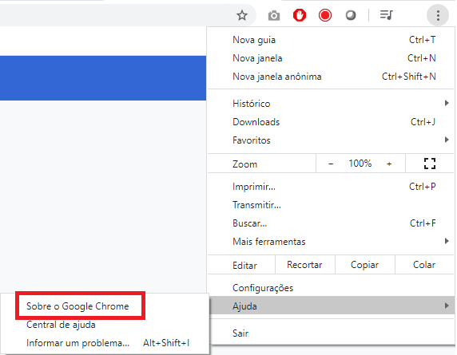
  
  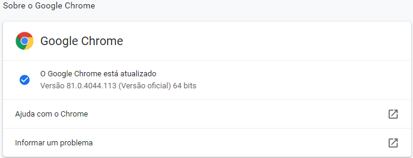
  
  * Unzip chromedriver.exe to the same folder where your project is located (chromedriver v81 is attached here)
  * Open VS Code and click on customize -> Python
  
  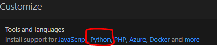
  
  * Start -> Open Folder -> Navigate to your project's folder
  
  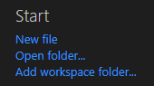
  
  ## WhatsappBot.py code - Step by step execution description
  * Import selenium, time, pandas and os
  
  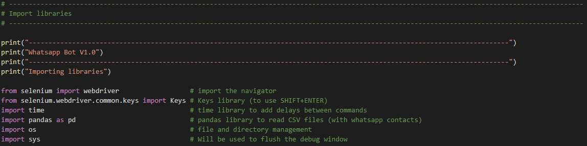
  
  * Write custom message and leave a \_NAME\_ key between underscores to replace with contact's names
  
  
  
  * Import CSV file with names and phone numbers and convert the generated dataframe to string
    * Depending on your CSV format, you may need to adjust the separator (space, comma, colon, semicolon etc.)

  
  
  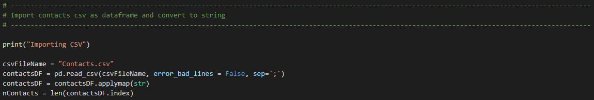
  
  * Get names and paths of all images on _Images_ folder (where all attachments must be located)
  
  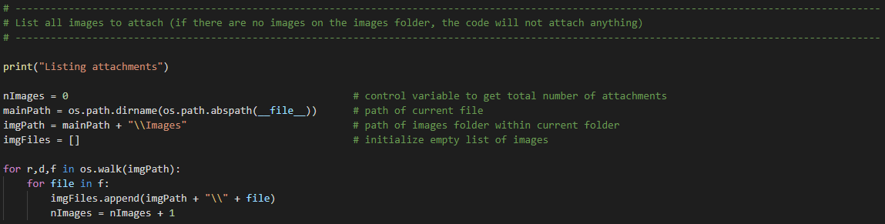
  
  * Create 2 custom functions: "clean" phone numbers and retrieve the contacts's first names
  
  
  
  * Create a webdriver object and navigate to whatsapp web
  
  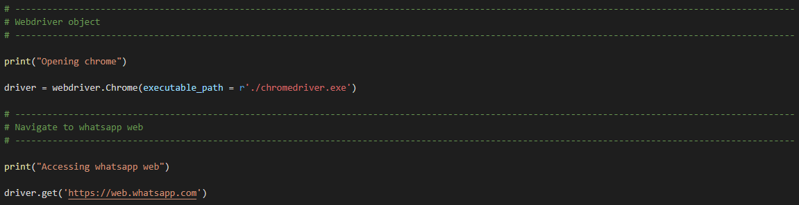
  
  * Wait 15 seconds for page to load and for user to scan QR code
  
  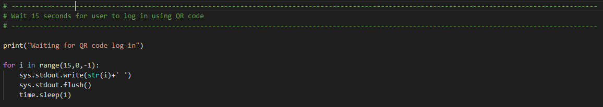
  
  * Loop all contacts from the CSV file
  
  
  
  * Find chat search box HTML tag and type the phone number
  
  
  
  
  
  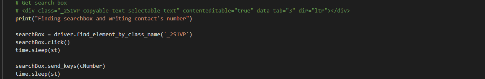
  
  * Get the found contact's HTML tag using its full name __exactly__ as it is on the phone's contacts list and click it
  
  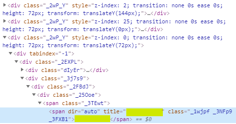
  
  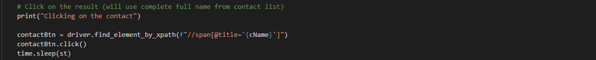

  * Get the message box HTML tag, write the customize message and send it
  
  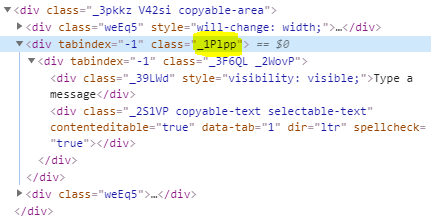
  
  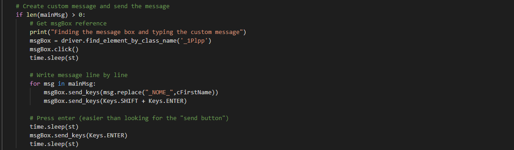
  
  * Find the attachment button (clip shaped) HTML tag and click it
  
  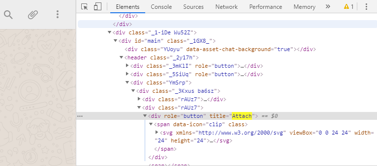
  
  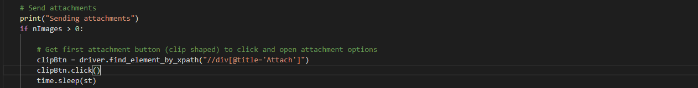
  
  * Find the Photos And Videos input HTML tag and use send_keys to input the location of all attachments
  
  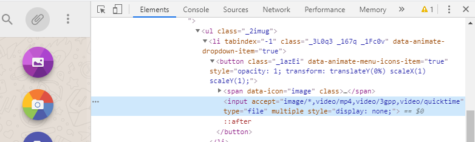
  
  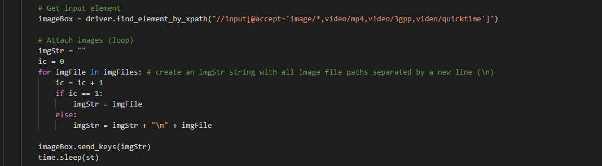
  
  * Find the "Send attachment" button HTML tag and click it
  
  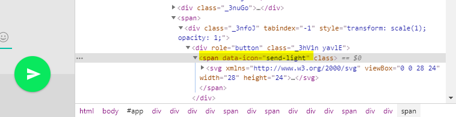
  
  
  
  * Repeat the process for the next contact on the CSV
 
## About me
I'm Danilo Vilardi, a Brazilian mechanical engineer with 10+ different hobbies and no time to pursue them all: programmer, photographer, electronic and woodwork dyi adventurer, musician and occasional CS gaming.
I'm social on:
* [Linkedin](https://www.linkedin.com/in/danilo-vilardi/)
* [Instagram](https://www.instagram.com/dvilardi/)
* [Facebook](https://www.facebook.com/dvilardi26)

## Acknowledgments
The following sources were used:
* Basic Whatsapp bot (messages to groups) (video in portuguese): https://www.youtube.com/watch?v=ISYHWfWvp3E
* Uploading files with selenium and webdriver (to send attachments): https://www.youtube.com/watch?v=ffHC36iTNRg
* Uploading single files on whatsapp Web https://www.youtube.com/watch?v=x85ba0VYsYo
